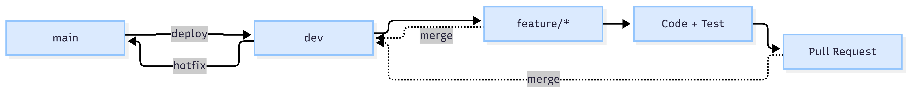

# Nền tảng du lịch học đường — CSE703073

## 1. Thông tin dự án

- Học phần: CSE703073 – Lập trình ứng dụng web trong du lịch 2
- Mã đề tài: ĐT-17
- Tên đề tài: Nền tảng du lịch học đường và chương trình trải nghiệm giáo dục
- Tên nhóm: <ĐIỀN THÔNG TIN THẬT CỦA BẠN>
- Lớp: <ĐIỀN THÔNG TIN THẬT CỦA BẠN>
- Giảng viên: TS. Nguyễn Văn Tánh

## 2. Bối cảnh

Nền tảng hỗ trợ quản lý các chương trình du lịch học đường
với trọng tâm về tính giáo dục, an toàn và thủ tục hành chính.

Hệ thống mô hình hóa ba nhóm người dùng chính:

- Nhà trường
- Phụ huynh
- Đơn vị tổ chức

## 3. Phạm vi chức năng

- Danh mục chương trình trải nghiệm.
- Gắn chương trình với cấp học.
- Gắn chương trình với môn học.
- Đăng ký theo lớp.
- Thu thập phiếu đồng ý của phụ huynh.
- Quản lý danh sách học sinh.
- Quản lý thông tin y tế cơ bản.
- Phân công giáo viên phụ trách.
- Điểm danh theo chặng.
- Thông báo cho phụ huynh trong hành trình.
- Đánh giá kết quả học tập sau chuyến đi.
- Hồ sơ an toàn của chương trình.

## 4. Kiến trúc công nghệ

Frontend:
Vue 3 + Vite

Backend:
PHP 8.3 + Laravel 11

Database:
MySQL 8.0

Data Processing:
Python 3.12 + pandas + scikit-learn + FastAPI

Web Server:
Nginx 1.24

Container:
Docker + Docker Compose

## 5. Sơ đồ kiến trúc

<BỔ SUNG ẢNH>

Ảnh kiến trúc:
docs/architecture.png

## 6. Môi trường yêu cầu

- PHP >= 8.2
- Composer >= 2.7
- MySQL >= 8.0
- Node.js >= 20
- Python >= 3.11
- Docker >= 24

## 7. Cấu trúc dự án

```text
du-lich-so/
├── backend/
├── frontend/
├── python-service/
├── database/
├── docker/
├── docs/
├── tools/
├── docker-compose.yml
├── .env.example
├── .gitignore
├── .gitattributes
├── .editorconfig
└── README.md

## 8. Tài khoản kiểm thử
| Vai trò        | Tài khoản                     | Mật khẩu                          |
| -------------- | ----------------------------- | --------------------------------- |
| Quản trị       | <ĐIỀN THÔNG TIN THẬT CỦA BẠN> | <KHÔNG ĐƯA MẬT KHẨU THẬT VÀO GIT> |
| Nhà trường     | <ĐIỀN THÔNG TIN THẬT CỦA BẠN> | <THÔNG TIN MÔ PHỎNG>              |
| Phụ huynh      | <ĐIỀN THÔNG TIN THẬT CỦA BẠN> | <THÔNG TIN MÔ PHỎNG>              |
| Đơn vị tổ chức | <ĐIỀN THÔNG TIN THẬT CỦA BẠN> | <THÔNG TIN MÔ PHỎNG>              |

## 9. Thành viên và phân công
| Họ tên                        | MSSV                          | Email                         | Vai trò                       | Phạm vi                       |
| ----------------------------- | ----------------------------- | ----------------------------- | ----------------------------- | ----------------------------- |
| <ĐIỀN THÔNG TIN THẬT CỦA BẠN> | <ĐIỀN THÔNG TIN THẬT CỦA BẠN> | <ĐIỀN THÔNG TIN THẬT CỦA BẠN> | <ĐIỀN THÔNG TIN THẬT CỦA BẠN> | <ĐIỀN THÔNG TIN THẬT CỦA BẠN> |
| <ĐIỀN THÔNG TIN THẬT CỦA BẠN> | <ĐIỀN THÔNG TIN THẬT CỦA BẠN> | <ĐIỀN THÔNG TIN THẬT CỦA BẠN> | <ĐIỀN THÔNG TIN THẬT CỦA BẠN> | <ĐIỀN THÔNG TIN THẬT CỦA BẠN> |
| <ĐIỀN THÔNG TIN THẬT CỦA BẠN> | <ĐIỀN THÔNG TIN THẬT CỦA BẠN> | <ĐIỀN THÔNG TIN THẬT CỦA BẠN> | <ĐIỀN THÔNG TIN THẬT CỦA BẠN> | <ĐIỀN THÔNG TIN THẬT CỦA BẠN> |
| <ĐIỀN THÔNG TIN THẬT CỦA BẠN> | <ĐIỀN THÔNG TIN THẬT CỦA BẠN> | <ĐIỀN THÔNG TIN THẬT CỦA BẠN> | <ĐIỀN THÔNG TIN THẬT CỦA BẠN> | <ĐIỀN THÔNG TIN THẬT CỦA BẠN> |
| <ĐIỀN THÔNG TIN THẬT CỦA BẠN> | <ĐIỀN THÔNG TIN THẬT CỦA BẠN> | <ĐIỀN THÔNG TIN THẬT CỦA BẠN> | <ĐIỀN THÔNG TIN THẬT CỦA BẠN> | <ĐIỀN THÔNG TIN THẬT CỦA BẠN> |

## 10. Dữ liệu
Toàn bộ dữ liệu học sinh sử dụng trong hệ thống là dữ liệu mô phỏng.

Không sử dụng dữ liệu học sinh thật.

## 11. Git Workflow


